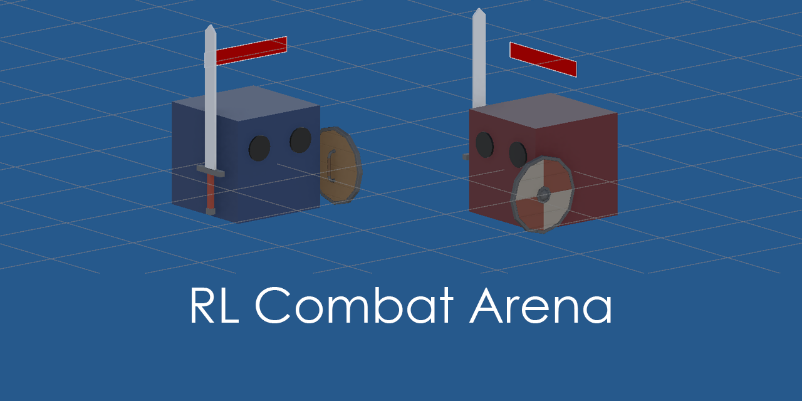

# RL Combat Arena



> Multi-agent physics-based melee combat in Unity ML-Agents with shared-policy team awareness, directional blocking and emergent combat strategies.


A reinforcement learning project where multiple agents learn to fight with swords and shields inside a physics-based arena.

The environment supports arbitrary numbers of fighters and teams while all agents can share the same neural network. Team identity is not encoded through fixed colors, tags or team-specific policies. Instead, custom perception sensors classify nearby fighters as allies or enemies dynamically from their team membership.

The combat system combines continuous physical movement with discrete sword and shield actions, animation-driven attack windows, directional blocking, health, knockback and multi-team round management.

No combat tactics are explicitly scripted. Blocking, counterattacking, target engagement, retreat, positional exploitation and several unintended reward-driven strategies emerged entirely during PPO training.

---

# Project Highlights

* Multi-agent melee combat with arbitrary team counts
* Single shared PPO policy
* Dynamic ally / enemy classification
* Custom 360° fighter perception sensor
* High-resolution weapon perception sensor
* Separate wall perception
* Continuous movement and rotation
* Discrete sword and shield control
* Animation-driven sword hitboxes
* Directional shield blocking
* Health, damage and physical knockback
* Automatic death and round management
* Randomized spawn positions and orientations
* Multi-team elimination rules
* Reward design experiments
* Emergent tactical behavior
* Reward exploitation discovered during training
* Unity ML-Agents + PPO

---

# Overview

The goal of this project was to build a reusable reinforcement learning environment for close-range multi-agent combat rather than a scripted duel.

The original concept began as a simple 1v1 sword-and-shield arena, but the design was gradually generalized into a system capable of spawning an arbitrary number of fighters and distributing them across multiple teams.

The duel therefore becomes only a special case:

```text
2 agents + 2 teams = 1v1
```

while the same environment can also represent:

```text
4 agents + 2 teams = 2v2
6 agents + 3 teams = 2v2v2
4 agents + 4 teams = free-for-all
```

All fighters use the same prefab and can use the same policy. Team membership, visual appearance, health and round state are assigned dynamically by the arena manager.

The final environment combines three separate perception systems with animation-based combat and physical interaction.

---

# Demo

## Multi-team combat with sword attacks, directional blocks and physical knockback.


A full evaluation video without scripted behavior can be added here:

[](https://youtu.be/your_video_link)

---

# Environment Design

The arena consists of physics-based fighters equipped with:

* a body collider,
* a sword with an animated blade hitbox,
* a shield,
* a Rigidbody,
* health,
* custom perception sensors,
* and a shared ML-Agents policy.

Each fighter can:

* move forward / backward,
* strafe,
* rotate,
* attack,
* raise or lower the shield.

Combat resolution is handled independently from the agent controller.

The environment therefore separates:

```text
FighterAgent
    ↓
actions / observations

FighterAnimationEvents
    ↓
animation state

CombatResolver
    ↓
damage / block / knockback

FighterHealth
    ↓
health / death

CombatRewardSystem
    ↓
reinforcement signal

CombatManager
    ↓
teams / spawn / round state
```

This separation made it possible to modify combat rules and reward design without rebuilding the agent controller.

---

# Team System

The environment does not rely on separate prefabs or hard-coded tags for individual teams.

Each fighter receives a runtime `TeamId`.

The arena manager:

* creates fighters,
* assigns team IDs,
* distributes agents between teams,
* assigns team colors,
* tracks surviving fighters,
* detects when only one team remains,
* ends the current round,
* and spawns a new population.

Team colors are generated automatically from HSV hue values, so the same system works with two teams or many teams.

Visual team color is used only for human readability. The neural network does not use color as an observation.

---

# Observation Space

The final policy receives approximately **85 vector observations**.

The observation space is deliberately divided into independent sensor groups rather than one large semantic state vector.

## Fighter Sensor

A custom 360° sphere-cast sensor detects nearby fighter bodies.

Each ray returns:

* normalized distance,
* object type.

Object type:

```text
0 = nothing
1 = ally
2 = enemy
```

This means the sensor does not depend on the absolute team number.

For example, an agent from Team 7 still receives:

```text
1 = ally
2 = enemy
```

rather than learning arbitrary team IDs.

The sensor operates in the local orientation of the fighter, so the perception plane rotates together with the physical body.

---

## Weapon Sensor

A separate sensor detects combat-relevant weapon states.

It ignores the fighter's own weapon hierarchy and observes external sword / shield objects.

The weapon sensor uses a denser ray layout because short attack windows require considerably higher angular precision than general fighter detection.

Typical observations include:

* active enemy sword,
* active shield,
* normalized distance.

The sensor deliberately avoids using visual input or explicit world-space positions.

---

## Wall Sensor

A third sensor detects arena boundaries.

Wall perception is kept separate from fighter and weapon perception through dedicated physics layers.

This allows the policy to distinguish:

```text
environment geometry
fighters
weapons
```

without requiring camera input.

---

## Internal State

The agent also observes its own combat state:

| Observation | Type |
| :--- | :--- |
| Current health | normalized scalar |
| Shield raised | binary |
| Shield transition / busy state | binary |
| Sword active | binary |
| Sword busy | binary |

These observations allow the policy to reason about animation timing instead of receiving actions in a completely stateless way.

---

# Action Space

The action space mixes continuous and discrete control.

## Continuous Actions

| Action | Range | Description |
| :--- | :---: | :--- |
| Move X | `[-1, 1]` | local lateral movement |
| Move Z | `[-1, 1]` | local forward / backward movement |
| Rotate Y | `[-1, 1]` | rotation around the fighter's vertical axis |

Movement is applied through Rigidbody forces rather than direct teleportation.

---

## Discrete Actions

Two binary branches control combat actions:

| Action | Values | Description |
| :--- | :--- | :--- |
| Sword | `0 / 1` | attack command |
| Shield | `0 / 1` | shield state |

Animation transitions determine when actions are physically possible.

The policy therefore cannot instantly switch between arbitrary combat states.

---

# Animation-Driven Combat

Sword and shield behavior are controlled through Animator state machines.

The sword attack follows a short animation cycle:

```text
Idle
 ↓
Sword Attack
 ↓
Idle
```

During selected animation frames the sword blade collider becomes active.

The shield follows a longer state loop:

```text
Idle
 ↓
Shield Raise
 ↓
Shield Up
 ↓
Shield Lower
 ↓
Idle
```

Animation events update runtime state flags such as:

* `SwordActive`
* `IsSwordBusy`
* `ShieldRaised`
* `ShieldTransition`
* `IsShieldBusy`

Correct Animator transition timing turned out to be critical.

Early versions allowed transitions back to `Idle` before the attack or shield-lowering clips had finished. As a result, the final Animation Events were never reached and combat-state flags remained permanently active.

The issue became particularly visible during reinforcement learning because agents generated action sequences much more aggressively than manual heuristic control.

---

# Combat Resolution

Damage is resolved when an active sword blade intersects another fighter.

The resolver checks:

1. whether the collider belongs to an active sword,
2. whether attacker and defender belong to different teams,
3. whether the defender currently has the shield raised,
4. whether the attack arrives from inside the configurable frontal blocking angle.

A successful hit:

* applies damage,
* applies physical knockback,
* emits a combat event.

A successful block:

* prevents or reduces damage,
* applies weaker knockback,
* emits a block event.

The frontal block angle is configurable in the Inspector.

This means the shield does not provide omnidirectional protection.

An agent can therefore attempt to attack from the side or behind.

---

# Health and Death

Each fighter has independent health.

The default combat setup uses:

```text
10 HP
1 damage per successful hit
```

so approximately ten direct hits are required to eliminate a fighter.

When health reaches zero:

```text
FighterHealth
    ↓
Died event
    ↓
CombatManager
    ↓
EndEpisode()
    ↓
fighter removed from arena
```

The rest of the battle continues.

For example:

```text
2v2
 ↓
one fighter dies
 ↓
2v1
```

The round ends only when fighters from a single team remain alive.

This makes individual death and round termination separate events.

---

# Round Manager

`CombatManager` is responsible for the global lifecycle of the arena.

It handles:

* fighter spawning,
* randomized spawn positions,
* randomized Y-axis orientation,
* runtime team assignment,
* team coloring,
* alive-agent tracking,
* round time limit,
* elimination detection,
* episode termination,
* and full round restart.

Spawn points are randomized inside a configurable radius around the arena center.

Random starting rotation prevents agents from relying on a fixed initial orientation.

---

# Reward Design

Reward design became one of the most important parts of the project.

Several configurations were tested.

Early dense reward experiments included:

| Event | Example reward |
| :--- | ---: |
| Successful hit | positive |
| Receive damage | negative |
| Successful block | positive |
| Attack into block | small penalty / zero |
| Death | negative |
| Team victory | positive |
| Time step | small negative |

This produced useful combat behavior quickly, but also exposed several forms of reward exploitation.

The project therefore became an experiment not only in combat control, but in how small changes in reinforcement signals alter multi-agent strategy.

---

# Reward Exploitation

## Passive Avoidance

With a reward configuration where combat risk outweighed the terminal victory reward, agents discovered that the safest strategy was simply to avoid each other.

They moved toward opposite sides of the arena and maintained maximum distance.

This was not a navigation bug.

From the policy's perspective:

```text
fight
→ possible negative reward

avoid combat
→ approximately zero reward
```

so avoidance became rational.

---

## Shield Farming

A later reward configuration assigned approximately equal value to:

* dealing damage,
* successfully blocking an attack.

Initially the result looked desirable: agents defended intelligently and frequently used the shield.

After additional training, however, the policy discovered an exploit.

Agents intentionally moved toward arena walls, allowed themselves to become cornered, raised the shield and waited for opponents to repeatedly attack them.

Because each successful block generated positive reward, the corner became a reliable reward-farming state.

This behavior was particularly deceptive because during earlier training it looked like legitimate defensive play.

The exploit appeared only after the policy had enough experience to intentionally seek the advantageous position.

---

# Emergent Behaviors

A number of strategies appeared without being explicitly programmed.

## Timed Blocking and Counterattacks

Agents learned to hold the shield through an opponent's attack and occasionally lower it immediately afterward to counterattack during the opponent's recovery period.

The timing is imperfect, but the behavior emerged entirely from animation-state observations and reinforcement.

---

## Multi-Hit Sword Control

One sword swing can produce more than one hit if the blade:

1. enters the enemy hitbox,
2. exits it during the active attack window,
3. and re-enters before the active frames finish.

Agents learned to exploit this intentionally.

They rotate and reposition their bodies during the swing so that the sword collider crosses the opponent multiple times.

The behavior is highly timing-sensitive and was not explicitly programmed.

Rather than being a collision bug, it emerged from the physical geometry of the combat system.

---

## Defensive Cornering

When surrounded or pushed against a wall, agents frequently keep the shield raised instead of attempting an impossible retreat.

This was initially interpreted as sensible defensive behavior.

Later policies went further and deliberately sought these positions when the reward for blocking was too large, turning a legitimate tactic into reward exploitation.

---

## Delayed Engagement

In asymmetric scenarios such as:

```text
2 vs 1 vs 1
```

one member of the two-agent team occasionally developed a strategy of staying away from the fight.

The agent would allow its teammate and the two independent opponents to fight first, avoiding personal risk and entering only after the number of surviving fighters had decreased.

The behavior appeared consistently during one stage of training and occurred primarily when the agent had a living ally.

It eventually disappeared as training continued, suggesting that the strategy was a temporary local optimum rather than the final policy.

---

## Circular Group Motion

With four or more agents, several reward configurations repeatedly produced a strange collective behavior.

The fighters began moving around the arena in near-regular circular trajectories.

Instead of immediately engaging, groups of agents maintained the rotation for extended periods.

The pattern appeared independently across multiple reward experiments.

One possible interpretation is that the shared policy found a low-risk cyclic state in which relative observations remained approximately stable.

The behavior was never explicitly rewarded or programmed.

---

# Shared Policy Dynamics

All fighters can use the same policy.

This produces a particularly constrained competitive learning problem.

Unlike air hockey, where many useful actions are not directly harmful to the opponent, melee combat is much closer to a zero-sum interaction:

```text
one agent deals damage
→ another agent receives damage

one agent survives
→ another agent dies

one team wins
→ every other team loses
```

This made reward balancing significantly more difficult.

If negative combat outcomes dominate, the shared policy can learn that avoiding combat is statistically preferable.

If dense positive combat rewards dominate, the policy can instead learn to farm those intermediate events rather than maximize actual victory probability.

Later experiments therefore focused increasingly on sparse terminal rewards and on balancing the reward magnitude across agents controlled by the same network.

---

# Policy Evolution

## Early Policy


Random movement, frequent missed attacks and poor shield timing.

↓

## Basic Combat


Agents approach opponents, attack reliably and begin using the shield.

↓

## Defensive Policy


Blocking becomes common and agents occasionally counterattack after successfully defending.

↓

## Reward Exploitation


Agents intentionally seek wall positions and farm repeated block rewards.

↓

## Multi-Agent Strategy


Multi-team fights produce temporary alliances, delayed engagement, target switching and local tactical behavior.

---

# Training

PPO was used for all primary experiments.

Example training configuration:

```yaml
behaviors:
  FighterBrain:
    trainer_type: ppo

    hyperparameters:
      batch_size: 2048
      buffer_size: 20480
      learning_rate: 3.0e-4
      beta: 5.0e-3
      epsilon: 0.2
      lambd: 0.95
      num_epoch: 3
      learning_rate_schedule: linear

    network_settings:
      normalize: true
      hidden_units: 256
      num_layers: 3

    reward_signals:
      extrinsic:
        gamma: 0.99
        strength: 1.0

    max_steps: 20000000
    time_horizon: 256
    summary_freq: 20000
    keep_checkpoints: 99
    checkpoint_interval: 50000
```

Multiple reward configurations were tested rather than treating the first reward function as final.

Intermediate checkpoints were also preserved because later training sometimes produced strategically different policies rather than simply stronger versions of earlier ones.

---

# Training Progress

TensorBoard was used to monitor PPO training.


Mean reward alone was not sufficient to evaluate policy quality.

One experiment produced a rapidly increasing reward curve because agents had learned to generate large numbers of successful blocks.

Visual inspection later revealed that the policy was deliberately entering defensive wall positions to farm the block reward.

This demonstrated an important lesson from the project:

> Increasing reinforcement reward does not necessarily mean that the learned policy is becoming better at the intended task.

Behavioral evaluation remained essential throughout training.

---

# Development Notes

A large part of the development effort was spent on environment design rather than neural-network architecture.

Important engineering problems included:

* building team-independent ally / enemy perception,
* filtering an agent's own weapon from weapon perception,
* keeping ray observations in the fighter's local orientation,
* synchronizing combat logic with animation frames,
* handling trigger colliders correctly through nested object hierarchies,
* separating local death from global round termination,
* preventing stale observations,
* and debugging reward-driven strategy exploits.

One particularly important lesson was that animation timing is part of the RL environment itself.

If an Animator transition interrupts a clip before its final Animation Event, the agent can receive impossible observations such as:

```text
Animator = Idle
SwordBusy = true
```

Even a small inconsistency like this can substantially alter reinforcement learning behavior.

---

# Results

The environment successfully produces policies capable of:

* locating nearby enemies,
* distinguishing allies from opponents,
* attacking with a physically animated sword,
* using directional shield blocks,
* surviving multi-agent engagements,
* counterattacking after enemy attacks,
* exploiting precise sword trajectories for repeated hits,
* and adapting behavior to local combat situations.

More importantly, the environment repeatedly generated strategies that were never explicitly programmed.

Some were useful tactical behaviors.

Others were reward exploits.

Both were valuable because they revealed how strongly multi-agent reinforcement learning depends on the exact relationship between perception, physics and reward design.

---

# Technologies

* Unity 6
* Unity ML-Agents
* C#
* PPO (Proximal Policy Optimization)
* Rigidbody physics
* Animator / Animation Events
* Custom SphereCast perception
* TensorBoard
* Barracuda / ONNX

---

# Known Issues / Limitations

* The learned policy is tightly coupled to the current animation timing, movement forces and physical combat parameters.
* Reward shaping can produce unexpected local optima such as passive avoidance or shield farming.
* Agents use ray-based perception rather than visual observations.
* Weapon detection is based on discrete ray / sphere-cast sampling and therefore has finite angular resolution.
* The policy does not receive a complete global state of the arena.
* Team strategy is emergent rather than explicitly coordinated.
* The current shared-policy setup can create unusual reinforcement dynamics because positive outcomes for one fighter frequently correspond to negative outcomes for another fighter using the same network.
* Policies trained with one number of fighters or teams may not immediately generalize to substantially different arena populations.
* Multi-agent behavior remains highly sensitive to reward scaling.
* The project was trained entirely in simulation.

---

# Future Work

* Self-play against historical policy checkpoints
* Randomized number of agents and teams during training
* Observation of remaining allied fighters
* Team-level reward experiments
* More advanced melee animations
* Multiple attack types
* Stamina system
* Shield break / stagger mechanics
* Procedural arena geometry
* Object pooling for large-scale training
* Automated combat statistics
* Evaluation against fixed historical policies
* Elo-style policy ranking
* Human vs AI combat mode

---

# Why This Project

The visible combat itself is deliberately simple.

The main objective was not to build a visually complex fighting game, but to create a reinforcement learning environment where:

* multiple autonomous agents interact through physics,
* team membership is dynamic,
* observations remain policy-independent,
* combat timing matters,
* local decisions affect long-term survival,
* and unexpected strategies can emerge.

The most interesting results were often behaviors that were never part of the original design.

Agents learned to exploit sword trajectories, wait out attacks before counterattacking, temporarily avoid combat when they had allies, form circular movement patterns and deliberately exploit defensive reward structures.

This made the project less about teaching an agent a predefined combat script and more about observing what strategies emerge when a shared neural policy is placed inside a constrained physical combat system.

---

# License

Released under the MIT License.
